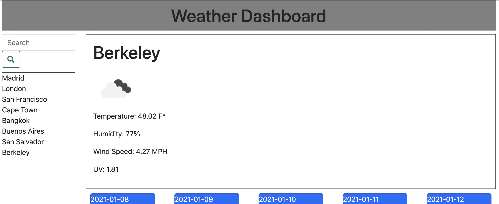

# Weather Dashboard

This is a weather dashboard application that displays the weather condition for any city of the user's choice. In addition to showing the current weather in any given city, it will also display the 5 day forecast.



## **Built With**
* [HTML](https://developer.mozilla.org/en-US/docs/Web/HTML)
* [CSS](https://developer.mozilla.org/en-US/docs/Web/CSS)
* [Git Hub](https://github.com/)
* [Open Weather API](https://openweathermap.org/api)
*  Git - used to track changes to code
______________________________________________________________________________
  
### **Summary**

The weather dashboard uses the Open Weather API to source weather data for any city of the user's chooseing around the world. The main body of the page is taken up by the most recently inputted city while the five day forecast is dynamically generated in blue cards underneath. The application is also capable of saving the most recently searched cities allowing the user to quickly refer to the cities most relevant to them. 

______________________________________________________________________________

#### **Code Snippet**

Sourcing information from the API involves using a unique API key to generate an object containing the informatin for each city. From there, we create variables by selecting specific elements in the object using dot notation. Finally, we concatonate the newly created variables to dynamically generate tags that are then pushed into the html using the .html method. 
```
            var cityName = response.city.name
            var icon = response.list[0].weather[0].icon
            var wind = response.list[0].wind.speed;
            var humidity = response.list[0].main.humidity;
            var temp = response.list[0].main.temp;
            var iconPic = "http://openweathermap.org/img/wn/" + icon + "@2x.png";

            $(".city").html("<h1>" + cityName + "</h1>");
            $(".icon").attr("src", iconPic)
            $(".temp").html("<p>Temperature: " + temp + " F°" + "</p>");
            $(".humidity").html("<p>Humidity: " + humidity + "%" + "</p>");
            $(".wind").html("<p>Wind Speed: " + wind + " MPH" + "</p>")

```


______________________________________________________________________________


#### **Deployed Link**

* [See Live Site](https://pamela-gutierrez.github.io/weather-dashboard/)

### **Author Links**

* **PAMELA GUTIERREZ**
* **UC Berkeley Coding Bootcamp**
  
- [Link to Portfolio Site](#)
- [Link to Github](https://github.com/pamela-gutierrez) 
- [Link to LinkedIn](www.linkedin.com/in/pamela-gutierrez)


______________________________________________________________________________

#### **License**

This project is licensed under the MIT License


   